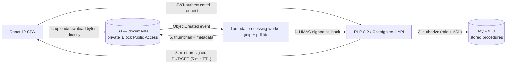

<!-- Secure Cloud Document Manager — Copyright (c) 2026 Arsi India Info. Licensed under the MIT License; see LICENSE. -->
<!-- The "Arsi India Info" name and logo are separately protected — see TRADEMARK.md. -->


# Secure Cloud Document Manager

A Dropbox/Google Drive-style business document manager: folders, versioned documents, internal permission grants,
expiring external share links, full-text search, and an async pipeline that generates real thumbnails and metadata
after upload — built on a React 19 + TypeScript frontend, a PHP 8.2 / CodeIgniter 4 API backed by MySQL 8 stored
procedures, and AWS S3 (via LocalStack for local dev).

It exists as a portfolio project: not a toy CRUD demo, but a system built the way a document-management product
handling real business records actually has to be — private-by-default cloud storage, a two-layer permission model
(global role + per-resource ACL with folder inheritance), and a signed-URL upload/download path where the API server
never streams a single file byte through itself. See the [signed-URL security](#private-storage--signed-url-security)
section below — it's the single design decision that most separates this from a beginner "upload to S3" tutorial.

## Features

**Documents & Folders**
- Hierarchical folders with soft-delete + restore, unique-sibling-name enforcement
- Versioned documents — every re-upload creates a new version, not an overwrite, with the version count guaranteed
  race-free under concurrent uploads
- Direct-to-S3 upload in three steps (initiate → browser `PUT`s to S3 → complete) so file bytes never pass through
  the API process
- Inline preview for PDF/PNG/JPEG, download-to-view fallback for everything else
- Full-text search across name/description/tags (MySQL `FULLTEXT` + `MATCH ... AGAINST`)
- Trash: soft-deleted items are recoverable within a configurable retention window

**Sharing**
- Internal per-resource ACL grants (`VIEWER`/`EDITOR`/`OWNER`), inherited from folder to document unless a more
  specific grant overrides it
- External, tokenized, expiring share links with an optional download cap — revocable, audit-logged, never a
  long-lived raw presigned URL
- A standalone public page (no login, no app shell) to resolve and download/view a share link

**Security**
- JWT access/refresh tokens (refresh tokens stored hashed, rotated on use)
- Two-layer authorization: global role (`ADMIN`/`MANAGER`/`EMPLOYEE`) + per-resource ACL, resolved through exactly one
  code path
- Non-participants get **404, never 403** on a resource they have no grant on — a 403 would itself leak that the
  resource exists
- Rate limiting (cache-backed, per-IP + per-route) and security headers (CSP, `X-Content-Type-Options`,
  `X-Frame-Options`) applied globally
- The private documents S3 bucket has Block Public Access enabled with no exceptions — see below

**Async Processing**
- An S3-event-triggered Node.js Lambda generates real image thumbnails (`jimp`) and extracts real PDF page-count
  metadata (`pdf-lib`), reporting back to the API over one HMAC-signed internal callback route — never a user JWT
- A documented virus-scan stub logs a result rather than integrating a real scanning engine (a deliberate, disclosed
  simplification, not a hidden gap)

**Admin**
- Dashboard (recent activity, storage summary, shared-folder shortcuts)
- User management (ADMIN-only invite/list/update)
- Full audit log of security-relevant actions (grants, deletes, restores, downloads, admin bypasses)

## Architecture



The API process never sees file bytes — it authenticates and authorizes the request, then hands back a signed
permission slip. Uploads/downloads happen browser-to-S3 directly. See [`docs/data-model.md`](docs/data-model.md) for
the full schema and stored-procedure index.

## Private Storage & Signed URL Security

**The one rule this project doesn't compromise on:** the documents S3 bucket has Block Public Access enabled, and no
bucket policy statement ever grants anonymous or wildcard access. There is no feature flag, code path, or "just for
the demo" exception that makes an object in this bucket reachable by a bare URL.

Every upload and download goes through the same three steps:

1. The browser asks the API for a signed URL for one specific action on one specific object.
2. The API authenticates the request (JWT) and authorizes it (global role + per-resource ACL — see Features above)
   *before* generating anything.
3. `S3Service` mints a presigned URL — scoped to that one exact object key, valid for 5 minutes — using IAM
   credentials that are themselves scoped to `PutObject`/`GetObject` only, with no `s3:ListBucket` and no
   `s3:DeleteObject`.
4. The browser uses that URL directly against S3 for the actual bytes. The API process is never in that data path.

Three reasons this shape, specifically, and not something simpler:

- **The bucket is private** because any public bucket is one misconfigured object ACL away from an open data leak —
  there's no reason a company's contracts and HR letters should ever be one guessable URL away from the public
  internet.
- **The backend generates the signed URL, never the frontend**, because the frontend can't be trusted to enforce
  authorization — only server-side code that has just checked "does this user have `VIEWER`+ on this document" can be
  trusted to mint a credential that grants access to it.
- **The URL expires in minutes, not hours**, so a leaked link (forwarded email, browser history, a proxy log) stops
  working quickly. Long-lived sharing goes through the explicit, revocable, audit-logged share-link mechanism
  instead — never a long-TTL presigned URL standing in for it.

## Screenshots

<!-- TODO: screenshots below are placeholders — none have been captured yet. -->
<!-- screenshot: folder browser with breadcrumb, showing Client Contracts > NovaTrail Logistics -->
<!-- screenshot: share dialog with an active external link and its expiry/download-count status -->
<!-- screenshot: the public share landing page, unauthenticated, mid-download -->

## Quick Start

```bash
git clone <this-repo>
cd secure-cloud-document-manager/infrastructure
docker compose up -d mysql localstack mailhog
```

Then follow [`docs/backend-setup.md`](docs/backend-setup.md) (migrate, seed, `php spark serve`) and
[`docs/frontend-setup.md`](docs/frontend-setup.md) (`npm install`, `npm run dev`) for the rest — each takes a couple
of minutes. Once both are running, sign in at `http://localhost:5173/login` with `admin@meridian.test` /
`Passw0rd!`, or follow [`docs/portfolio-demo.md`](docs/portfolio-demo.md) for a guided walkthrough of the seeded data.

## Documentation

| Doc | Covers |
|---|---|
| [`docs/backend-setup.md`](docs/backend-setup.md) | Composer install, `.env`, migrations, seeding, `php spark serve`, tests |
| [`docs/frontend-setup.md`](docs/frontend-setup.md) | `npm install`, `.env`, dev server, build, Vitest, Playwright |
| [`docs/data-model.md`](docs/data-model.md) | Table inventory, ER diagram, stored-procedure index |
| [`docs/testing.md`](docs/testing.md) | Test layers, how to run each, the two Definition-of-Done tests explained |
| [`docs/deployment.md`](docs/deployment.md) | Docker Compose (primary) and the authored-but-unapplied AWS/Terraform path |
| [`docs/contributing.md`](docs/contributing.md) | Branch naming, Conventional Commits, PR outline, required CI checks |
| [`docs/portfolio-demo.md`](docs/portfolio-demo.md) | A literal, step-by-step 5-minute walkthrough of the seeded demo data |
| [`docs/api.md`](docs/api.md) | Response envelope, the 404-vs-403 guardrail, pagination — a companion to the live spec |
| [`/api/docs`](http://localhost:8080/api/docs) · [`/api/docs.json`](http://localhost:8080/api/docs.json) | The generated OpenAPI spec (non-production only) |

## Tech Stack

| Layer | Technology |
|---|---|
| Frontend | React 19, TypeScript, Vite, TanStack Query, React Hook Form + Zod, Tailwind CSS |
| Backend | PHP 8.2, CodeIgniter 4.7, `firebase/php-jwt`, `aws/aws-sdk-php`, `zircote/swagger-php` |
| Database | MySQL 8 (MySQLi), business logic in stored procedures |
| Storage | AWS S3 (LocalStack for local dev) — private documents bucket, public SPA bucket |
| Async processing | Node.js 20 Lambda — `jimp` (thumbnails), `pdf-lib` (PDF metadata) |
| Testing | PHPUnit 10 + CIUnitTestCase feature tests, Vitest + React Testing Library, Playwright |
| Infra | Docker Compose (MySQL, LocalStack, Mailhog, API, web), Terraform under `infrastructure/aws/` |
| CI | GitHub Actions — license headers, PHPStan + PHPUnit, `tsc`/ESLint/Vitest/build |

## License & Branding

Source code is licensed under the [MIT License](LICENSE). The "Arsi India Info" name, the "Innovate · Integrate ·
Elevate" tagline, and the accompanying logo are covered separately by [`TRADEMARK.md`](TRADEMARK.md) — forks and
self-hosted deployments are welcome under MIT, but shouldn't present themselves as Arsi India Info's own product or
reuse its branding.

© 2026 [Arsi India Info](https://arsiindiainfo.com)
