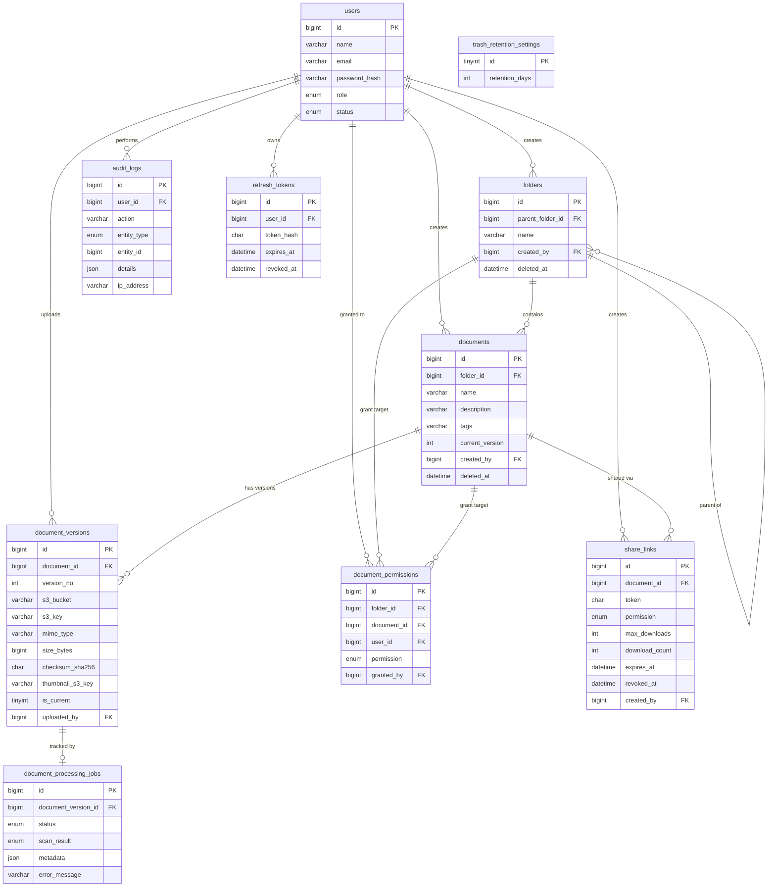

# Data Model

MySQL 8, `InnoDB`/`utf8mb4` throughout. Business rules that need a transaction or a row lock live in stored procedures
(`app/Database/Procedures/*.sql`), loaded by the migration `2026-08-29-100011_LoadStoredProcedures.php` — Models call
`CALL sp_xxx(...)` rather than composing raw multi-statement SQL, so locking/transaction logic exists in exactly one
place per operation.

## Table inventory

| Table | Purpose |
|---|---|
| `users` | Accounts: name, email, bcrypt password hash, global role (`ADMIN`/`MANAGER`/`EMPLOYEE`), status |
| `folders` | Hierarchical folders; self-referencing `parent_folder_id`, soft-deletable, unique name among siblings |
| `documents` | Document records (name/description/tags/current version pointer); FULLTEXT-indexed for search |
| `document_versions` | One row per uploaded version of a document — S3 location, mime type, size, checksum, thumbnail key |
| `document_permissions` | Per-resource ACL grants (`VIEWER`/`EDITOR`/`OWNER`) — polymorphic: exactly one of `folder_id`/`document_id` is set |
| `share_links` | External, tokenized, expiring share links with optional download caps |
| `audit_logs` | Append-only log of security-relevant actions, written by the stored procedures themselves |
| `refresh_tokens` | Hashed (never plaintext) JWT refresh tokens, rotated on use |
| `document_processing_jobs` | Status board for the async thumbnail/metadata pipeline, one row per version |
| `trash_retention_settings` | Single-row config: how many days a soft-deleted item stays recoverable |

## ER diagram

Notable constraints straight from the migrations:

- `document_permissions` has a `CHECK` forcing exactly one of `folder_id`/`document_id` to be set, plus separate unique
  keys `(folder_id, user_id)` and `(document_id, user_id)` — one grant per user per resource.
- `document_versions` has `UNIQUE (document_id, version_no)` and is the row `sp_document_new_version` locks with
  `SELECT ... FOR UPDATE` to serialize concurrent version numbering (see [`docs/testing.md`](testing.md)).
- `documents` carries a `FULLTEXT KEY` over `(name, description, tags)`, which `sp_document_search` queries with
  `MATCH ... AGAINST ... IN BOOLEAN MODE`.
- `folders`/`documents`/`users` are all soft-delete (`deleted_at`), never hard-deleted by the API.

## Stored procedure index

### Users & auth
| Procedure | Purpose |
|---|---|
| `sp_user_authenticate` | Looks up a user by email; returns the password hash/role/status for the login flow to verify |
| `sp_user_invite` | Creates a new user (ADMIN-only invite flow) |

### Folders
| Procedure | Purpose |
|---|---|
| `sp_folder_create` | Creates a folder, auto-grants the creator `OWNER`, rejects duplicate sibling names |
| `sp_folder_rename_move` | Renames and/or moves a folder to a new parent |
| `sp_folder_soft_delete` | Soft-deletes a folder (and, per its `p_affected_count` out param, whatever it cascades to) |
| `sp_folder_restore` | Restores a soft-deleted folder — fails if its parent is still deleted |

### Documents & versions
| Procedure | Purpose |
|---|---|
| `sp_document_upload_commit` | Finalizes a completed direct-to-S3 upload into a new `documents` row + first version |
| `sp_document_new_version` | Adds a new version to an existing document; the row-lock-guarded, concurrency-safe one |
| `sp_document_update` | Updates name/description/tags/folder |
| `sp_document_soft_delete` / `sp_document_restore` | Trash lifecycle — idempotent delete, restore blocked if the parent folder is still deleted |
| `sp_document_search` | Builds the caller's visible-document set (direct grants + inherited folder grants, or everything if ADMIN), then filters/sorts/paginates it |

### Sharing
| Procedure | Purpose |
|---|---|
| `sp_document_permission_grant` | Upserts an internal ACL grant (`VIEWER`/`EDITOR`/`OWNER`) on a document |
| `sp_document_permission_revoke` | Removes a grant — refuses to remove the last `OWNER` |
| `sp_share_link_create` | Generates a token-based external share link with an expiry and optional download cap |
| `sp_share_link_consume` | Validates and atomically increments a share link's `download_count`; returns why a link failed (`EXPIRED`/`REVOKED`/`LIMIT_REACHED`/`NOT_FOUND`) |
